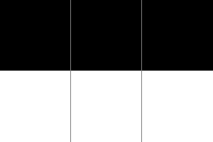
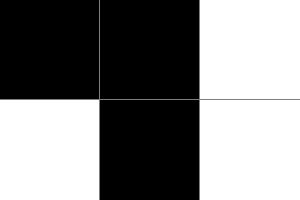
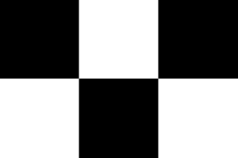
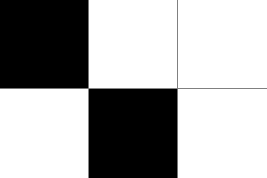
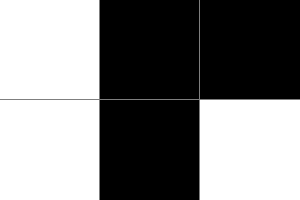
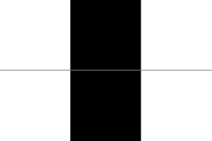
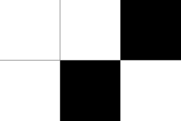
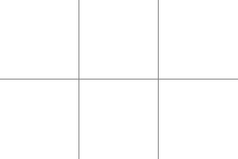

# Instructions
It's hard to reverse a step in a cellular automata, but solvable if done right.
Further instructions are given on the webpage:
<https://cellularautomata.web.ctfcompetition.com/>

# Solution

What we have in this challenge is an encrypted flag that we need to decrypt.
To do this, we need to reduce the search space of all the possible decryption keys.
As described on the website of the challenge, we only need to consider the decryption keys such that, when interpreted as the automata in a cellular automaton with `rule 126` as transition rule, we obtain the given final states `66de3c1bf87fdfcf`, or `0110011011011110001111000001101111111000011111111101111111001111` in binary.

Let us start by reading up on `rule 126`, I used [this](http://mathworld.wolfram.com/Rule126.html) webpage.
For convienence, I will illustrate the transition rules below.

<table>
	<tr>
		<td> 1. </td> <td> </td>
		<td> 2. </td> <td> </td>
		<td> 3. </td> <td> </td>
		<td> 4. </td> <td> </td>
	</tr>
	<tr>
		<td> 5. </td> <td> </td>
		<td> 6. </td> <td> </td>
		<td> 7. </td> <td> </td>
		<td> 8. </td> <td> </td>
	</tr>
</table>


First, we have to determine if `0` corresponds to a white cell, or a black cell.
The website gives us some example transitions, so we implement a Python script to perform `rule 126` and check which interpretation leads to the correct output.
```python
def rule_126(cells):
	new_cells = ""
	new_cells += update_cell(cells[-1], cells[0], cells[1])
	for i in range(1, len(cells) - 1):
		new_cells += update_cell(cells[i - 1], cells[i], cells[i + 1])
	new_cells += update_cell(cells[len(cells) - 2], cells[len(cells) - 1], cells[0])
	return new_cells

def update_cell(cl, c, cr):
	if cl == BLACK and c == BLACK and cr == BLACK:
		return WHITE
	if cl == BLACK and c == BLACK and cr == WHITE:
		return BLACK
	if cl == BLACK and c == WHITE and cr == BLACK:
		return BLACK
	if cl == BLACK and c == WHITE and cr == WHITE:
		return BLACK
	if cl == WHITE and c == BLACK and cr == BLACK:
		return BLACK
	if cl == WHITE and c == BLACK and cr == WHITE:
		return BLACK
	if cl == WHITE and c == WHITE and cr == BLACK:
		return BLACK
	if cl == WHITE and c == WHITE and cr == WHITE:
		return WHITE
	raise Exception("Unknown: {} {} {}".format(cl, c, cr))
```
As it turns out, `0` corresponds to white and `1` to black.


Next, we have define a number of rules so that we can generate a penultimate state.
Since there is no one-to-one correspondence between a state and its successor, we should not expect to arrive at the decryption key exactly, but instead only to reduce the search space to something brute-forceable.
We will use lettered cells to indicate relationships between the colors of cells.
For example, all cells labeled `A` are the same color.
We indicate a cell that is not color `A` as `a`.
Finally, a cell with irrelevant, or unknown color is denoted `?`.

The first rule to notice is that every white cell in the final state, was the same color as both its neighbors in the penultimate state (this can be seen from rules 1 and 8 above).
So, every sequence of white cells in the final state, was a sequence of same-colored cells in the penultimate state (with two additional same-colored cells on both sides).
Here follows a visual representation of this idea.
For a single white cell in the final step:
<table>
	<tr>
		<td> <tt>a</tt> </td><td> <tt>a</tt> </td><td> <tt>a</tt> </td>
	</tr>
	<tr>
		<td> <tt>?</tt> </td><td> <tt>0</tt> </td><td> <tt>?</tt> </td>
	</tr>
</table>
For a sequence of white cells in the final state:
<table>
<tr>
		<td> <tt>a</tt> </td><td> <tt>a</tt> </td><td> <tt>a</tt> </td><td>...</td><td> <tt>a</tt> </td><td> <tt>a</tt> </td><td> <tt>a</tt> </td>
	</tr>
	<tr>
		<td> <tt>?</tt> </td><td> <tt>0</tt> </td><td> <tt>0</tt> </td><td>...</td><td> <tt>0</tt> </td><td> <tt>0</tt> </td><td> <tt>?</tt> </td>
	</tr>
</table>


This already reduces the search space significantly, but we can do better still.
Consider two sequences of white cells, s1 and s2, seperated by two black cells (note that its impossible to have white cells separated by a single black cell).
These two sequences each had sequences of same-colored predecessors, respectively, but the two sequences could not have been the same color! (Otherwise, there would be no two separating black cells).
Therefore, we can impose a rule that the predecessors of s1 are not the same as s2.
Here is a visual representation:
<table>
	<tr>
		<td> <tt>a</tt> </td><td> <tt>a</tt> </td><td> <tt>a</tt> </td><td> <tt>A</tt> </td><td> <tt>A</tt> </td><td> <tt>A</tt> </td>
	</tr>
	<tr>
		<td> <tt>?</tt> </td><td> <tt>0</tt> </td><td> <tt>1</tt> </td><td> <tt>1</tt> </td><td> <tt>0</tt> </td><td> <tt>?</tt> </td>
	</tr>
</table>

<table>
	<tr>
	<td> <tt>a</tt> </td><td> <tt>a</tt> </td><td>...</td><td> <tt>a</tt> </td><td> <tt>a</tt> </td><td> <tt>A</tt> </td><td> <tt>A</tt> </td><td>...</td><td> <tt>A</tt> </td><td> <tt>A</tt> </td><td> <tt>a</tt> </td><td> <tt>a</tt> </td><td>...</td><td> <tt>a</tt> </td><td> <tt>a</tt> </td>
	</tr>
	<tr>
	<td><tt>?</tt></td> <td><tt>0</tt></td> <td>...</td> <td><tt>0</tt></td> <td><tt>1</tt></td> <td><tt>1</tt></td> <td><tt>0</tt></td> <td>...</td> <td><tt>0</tt></td> <td><tt>1</tt></td> <td> <tt>1</tt> </td><td> <tt>0</tt> </td><td>...</td><td> <tt>0</tt> </td><td> <tt>?</tt> </td>
	</tr>
</table>


This allows us to construct groups of cells for the predecessor cells.
Each group consists of two sets, all cells in a set have the same color and the cells in one set has the opposite color of cells in the other set.
Each group corresponds to a color variable.

The only place where a new independent color variable is introduced, is when three or more black cells appear in a row.
Then we cannot say for certain whether predecessor states where the same color or not.
<table>
	<tr>
		<td> <tt>a</tt> </td><td> <tt>a</tt> </td><td> <tt>a</tt> </td><td> <tt>A</tt> </td><td> <tt>A</tt> </td><td> <tt>A</tt> </td><td> <tt>a</tt> </td><td> <tt>b</tt> </td><td> <tt>?</tt> </td>
	</tr>
	<tr>
		<td> <tt>?</tt> </td><td> <tt>0</tt> </td><td> <tt>1</tt> </td><td> <tt>1</tt> </td><td> <tt>0</tt> </td><td> <tt>1</tt> </td><td> <tt>1</tt> </td><td> <tt>1</tt> </td><td> <tt>?</tt> </td>
	</tr>
</table>

Applying this idea to the final step given for the challenge, yields these color variables:
`AAaaaaAAAaaaABbbbbbBCcccccccCCCcDEFGggggggGHIJKLMmmmMNOPQqqqqQRA`

Since we only have 18 independent variables, we can brute force all possible assignments of `1` and `0` to these groups.
For each assignment, we check if applying `rule 126` thereto results in the provided final step.
If it does, we print it as a possible solution.

The Python script below illustrates this idea:
```python
groups = []
# Looking for the start of new groups (...111, but only 11 is part of this group)
for group_match in re.finditer(r'(?:[01]*?(?<=1)1(?=1)(?!10))', final_step):
    offset = group_match.start(0)
    comp = False
    group = {'set':[], 'comp':[]}
    if offset == 0:
        group['set'].append((len(final_step) - 1, len(final_step) - 1)) # Hack to add the last cell to the group of the first (since it cyclic) this will not generalize
    # Look for sequences between 1's. (these will be where we will require complements.)
    for set_match in re.finditer(r'(?:10+1|1|^0+1)', group_match.group(0)):
        if not comp:
            group['set'] += [(offset + set_match.start(0), offset + set_match.end(0) - 1)]
        else:
            group['comp'] += [(offset + set_match.start(0), offset + set_match.end(0) - 1)]

        comp = not comp
    groups.append(group)

    # Brute force assignments to groups
    for assignments in itertools.product((0, 1), repeat=len(groups)):
        possible_prev_state = ["_" for i in range(len(final_step))]
        for g, group in enumerate(groups):
            for (low, high) in group['set']:
                for i in range(low, high + 1):
                    if assignments[g] == 0:
                        possible_prev_state[i] = "0"
                    else:
	                    possible_prev_state[i] = "1"
            for (low, high) in group['comp']:
	            for i in range(low, high + 1):
                    if assignments[g] == 0:
                        possible_prev_state[i] = "1"
                    else:
                        possible_prev_state[i] = "0"
        possible_prev_state = "".join(possible_prev_state)
        recoverd_final_state = rule_126(possible_prev_state)
        recoverd_final_state_hex = bin_to_hex(recoverd_final_state)
        if recoverd_final_state_hex == final_step_hex:
            print(bin_to_hex(possible_prev_state))
```

Finally, we try do decrypt the flag with each of the possible solutions to retrieve the flag.


# Flag
CTF{reversing\_cellular\_automatas\_can\_be\_done\_bit\_by\_bit}
